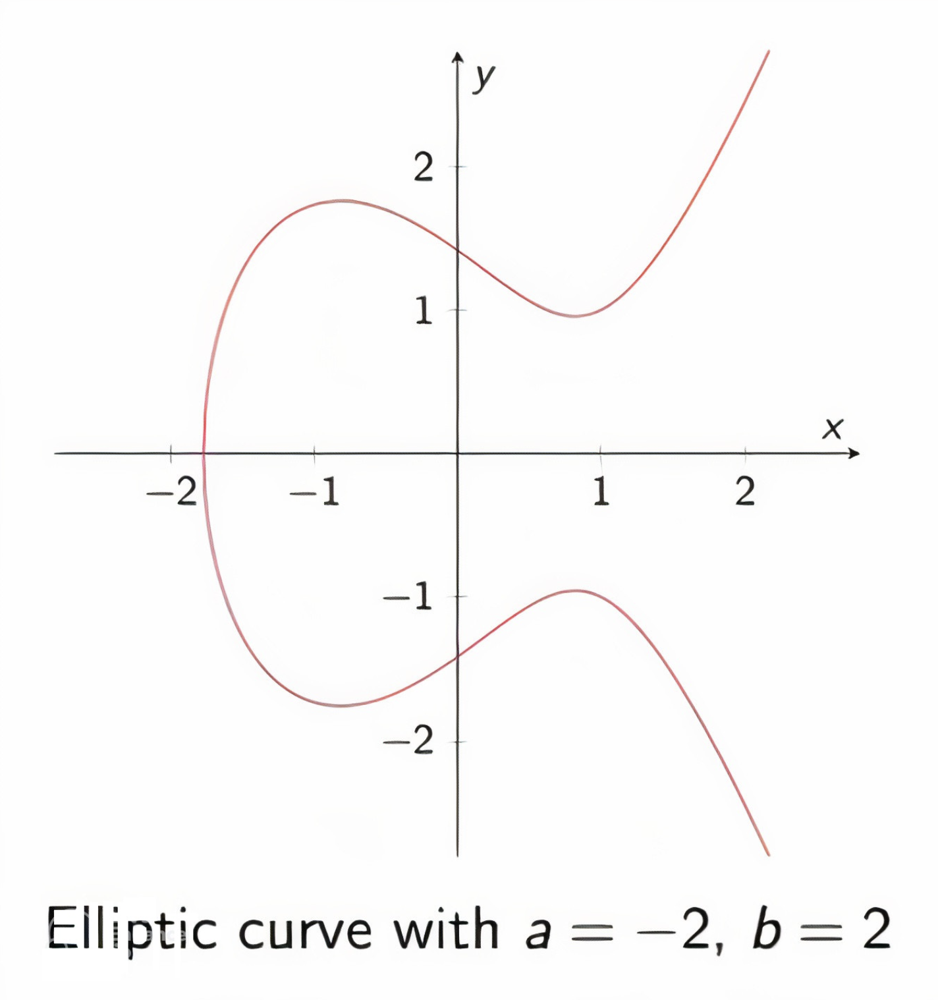
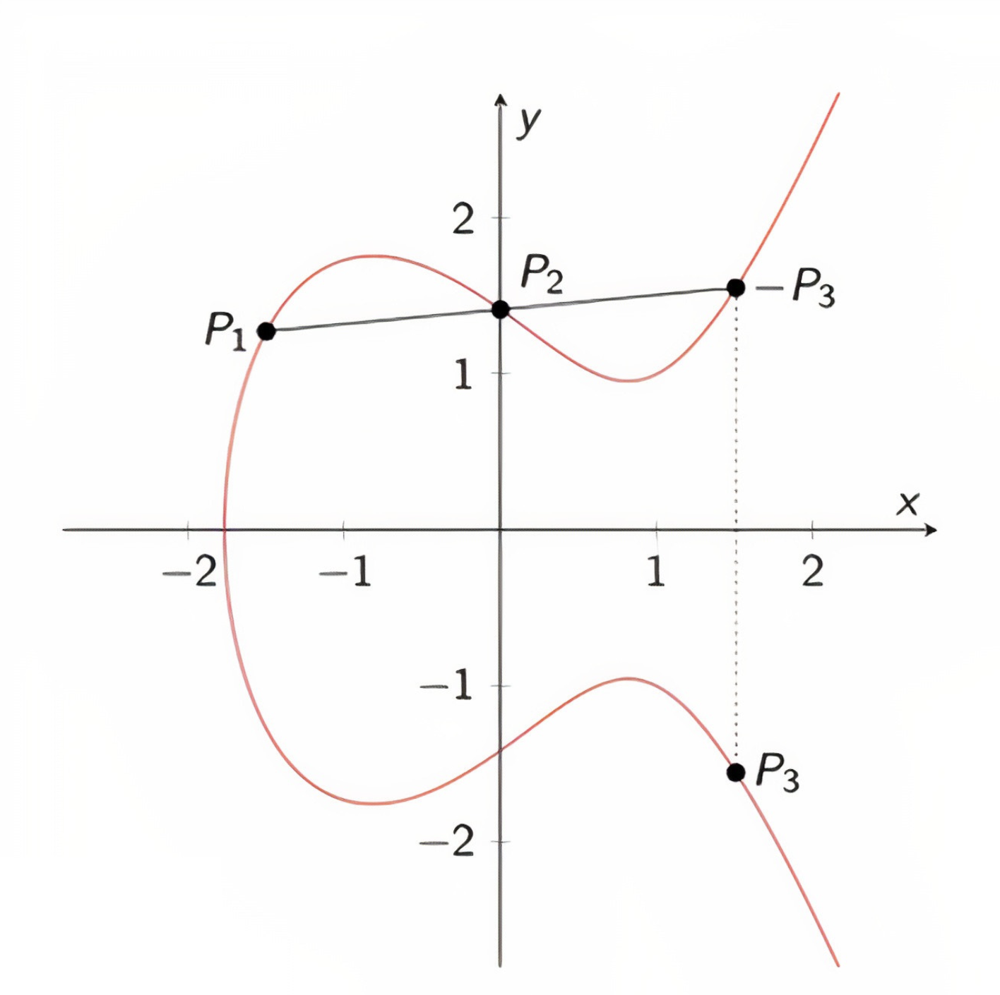
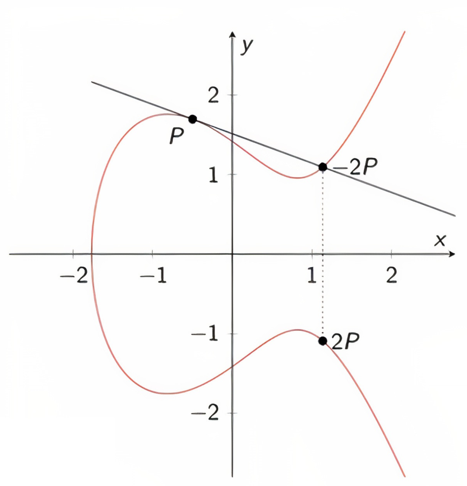

# Elliptic Curve

The Elliptic Curve Digital Signature Algorithm (ECDSA) is a Digital Signature Algorithm (DSA) which uses keys derived from elliptic curve cryptography (ECC)

Elliptic curve is a curve defined by an equation of the form:
$y^2 = x^3 + ax + b$ [1]



Says, $(x, y)$ is a point on the curve if it satisfies the equation. Here, we define some useful operations on points on the curve.

### 1.1 Point Addition 



Lets imagine, we have two points $P_1 = (x_1, y_1)$ and $P_2 = (x_2, y_2)$ on the curve. We want to find $P_3 = (x_3, y_3)$ such that $P_1 + P_2 = P_3$. 

The procedure to find $P_3$ is as follows:
1. The slope of the line passing through $P_1$ and $P_2$ is given by:
- $s = \frac{y_2 - y_1}{x_2 - x_1}$ [2]

2. Using the slope $s$, we can find the coordinates of $P_3$ using:

- $x_3 = s^2 - (x_1 + x_2)$ [3]
- $y_3 = s(x_1 - x_3) - y_1$ [4]

where $s = \frac{y_2 - y_1}{x_2 - x_1}$ is the slope.


### 1.2 Point Doubling 

Now, we define doubling a point $P = (x, y)$ on the curve. 


The equation need to be answered is:
$P + P = 2P = ?$

The procedure would be similar to adding two points, except that the slope of the line passing through $P$ and itself will be:
$s = \frac{3x^2 + a}{2y}$ [5]

```note
s here is the tangent line on point P. We can find it, by taking the derivative of the curve equation [1] and plugging in the coordinates of P.
``` 

  - $2y · dy/dx = 3x² + a$

  -  $dy/dx = \frac{3x² + a}{2y}$


