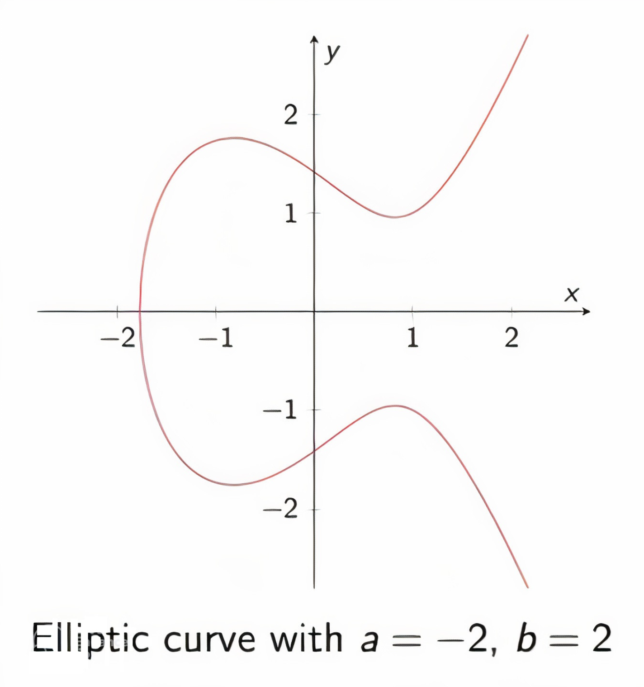

# Schnorr 

> Schnorr use the same `private-public` key pairs, the only difference is in the signing and verification algorithm, which happens to be a lot simpler than [ECDSA](ecdsa.md). 

Schnorr is:
- provable security 
- smaller signature size (to provide the same level of security as ECDSA)
- faster verification: it is important, since signing happens once, but <mark>verification happens many times</mark>
- provide a simple and efficent way to enable multi-signatures 

# Signing 

### Prerequisites 
- private key: $k$
- pubkey: $P = k \times G$
- Message: $m$

### Algorithm 
1. Choose $z$
2. Calculate: $R = z \times G$
3. `X-coordinate of R`: $r$
4.  $s = z + Hash(x || m) k$
5. return ($r,s$)

# Verifying 

## Prerequisites 

Get $P$, $(r, s)$, $m$

## Algorithm 
### 1. Reconstruct $R$ from $r$

We have $r$ , which is the `x-coordinate`  of the curve point $R$. To reconstruct it, we use a special function call `lifting(r) -> R`. 
- there would be two possible points (`x`, `y` ) and (`x, -y`)
- Curve equation: `y^2` = `x^3` + `ax` + `b`

So we would make an assumption, agree to choose one, for example, <mark>always take the even y </mark>

### 2. Assert 

$s \times G$ = $R + Hash(r||m) \times P$

- $s$ = $z$ + $Hash(r||m)k$

-  $z \times G$ + $Hash(r||m)k \times G$ = $R$ + $Hash(r||m) \times P$

