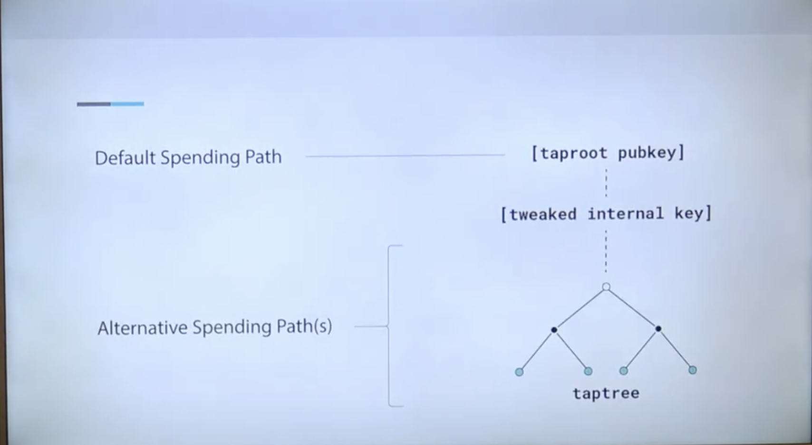
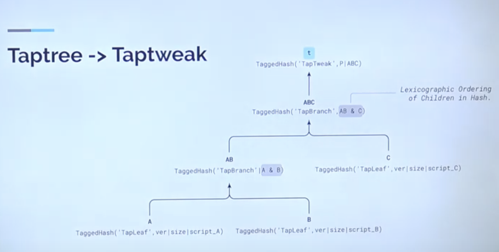

# Taproot
Source:
* https://www.youtube.com/watch?v=1gRCVLgkyAE
* https://www.youtube.com/watch?v=KLNH0ttpdFg

## Taproot public key
Format: `[01] [32B Tweaked Public Key]`
* with `[01]` as SegWit version 1: Taproot
* 32 bytes tweaked public key

## Taproot spending path
Source:
* https://www.youtube.com/watch?v=n-jAUaSkcAA

Schnorr verification: `R = s*G - H(R || Q || M)*Q`
* with `Q = P + t*G` as tweaked public key
* with P as internal public key
* with t = H(P || c) as tweak
  * key spend path: c is null thus t = H(P)
  * script spend path: c exists thus t = H(P || c)
* with c normally as Taptree Merkle root

### key spend path
* Aggregated pubkey/signature
* Key spend path hides multi-party contract
* Will probably be used by MuSig2
* 64 bytes signature (32 bytes nonce R + 32 bytes signature scalar S) (R, S) OR 65 bytes with [SIGHASH](BIP0143-sighash.md) (R, S, SIGHASH)

### script spend path
* In aggregate, enforce the multi-party contract
* Allow defining many different spend conditions: script_0 OR script_1 OR script_n
* | witness data | tap script | control block |
  * witness data: any necessary data required by the executed tap script (signature, data, ...)
  * tap script: the actual script being executed. This is **a fragment of the entire** possible script set that was committed to in the Taptree (only need to reveal a Tapleaf)
  * control block: provide all the necessary information to verify that the revealed Tapscript (**a fragment of Taptree, not all Tapleaf**) is valid and included in the Taproot tree. It includes `parity bytes`, `internal pubkey`, `script inclusion proof`.

### why is the need for Taproot tweak?
Source: 
* https://www.youtube.com/watch?v=EkGbPxAExdQ
* https://colab.research.google.com/github/bitcoinops/taproot-workshop/blob/Colab/2.2-taptweak.ipynb

Tweaking a public key means to alter it with a value (the tweak) such that it **remains spendable** with knowledge of the original private key and tweak
* x / P: Original private key / public key pair (internal private key)
* t / T: Tweak value / tweak point (0 < t < SECP256K1_ORDER)
* G: generator point on curve
* Output script: `[01] [P + T] = [01] [xG + tG]`
* Spendable by the tweaked private key: x + t

Tweaking is intended for adding additional Tapscript tree commitment into the pubkey. Tweak value is `t = H(P || c)` with `c` as Taptree Merkle root, or any data commitments actually. `c` must be reconstructed from provided script-spend-path witness composed of `s | tap script | control block`. The details of `c` reconstruction:
* extract `parity bytes`, `P`, `script inclusion proof` from `control block`
* combine `tap script` hash, and `script inclusion proof` to derive `merkle root` (which is `c`)
* `c` will then be used to calculate the tweak `t = H(P || c)` for future Schnorr verification

Tweaking still keep pubkey size of 32 bytes. It is such a miracle of privacy and data size.

## Tapscript
Source:
* https://www.youtube.com/watch?v=nXGe9_M5pjk
* https://colab.research.google.com/github/bitcoinops/taproot-workshop/blob/Colab/2.3-tapscript.ipynb

### Script evaluation (P2TR):
1. A hashed public key of 33 bytes (`[01] [32B Tweaked Public Key]`) is attached to an output
2. Based on specific spending witness (#taproot-spending-path), witness is verified against Taproot pubkey

### Added `OP_CHECKSIGADD` to replace legacy `OP_CHECKMULTISIG` and `OP_CHECKMULTISIGVERIFY`. 

Legacy k-of-n multisignature opcodes would previously check each of the k signatures against up to n public keys. This is **inefficient O(k*n) and disables batch verification of schnorr signatures**, since:

`pubkey and signature pairs cannot be known prior to script execution.` (why?)

This multisignature signature opcode `OP_CHECKSIGADD` (CSA) requires the witness to provide a valid or invalid signature for each public key O(n), thereby avoiding the need to waste signature verification operations for each public key in k-of-n multisignature scripts

MuSig would cost O(1) through `key spend path`

1. Use CSA to compose a linear 2-of-3

2. Compose 3 2-of-2 spending Tapleaf

### Tapscript descriptor
1. Descriptor: https://github.com/bitcoin/bitcoin/pull/22051
2. Usage: https://github.com/bitcoin/bitcoin/pull/21365#issuecomment-792794101

## Taptree
Source:
* https://colab.research.google.com/github/bitcoinops/taproot-workshop/blob/Colab/2.4-taptree.ipynb
* https://www.youtube.com/watch?v=n6R15Eo6J44

A Taptree commits multiple Tapscripts to a Taptweak in a Merkle tree structure
* internal node is tagged as `TapBranch`
* leaf node is tagged as `TapLeaf`

To minimize the expected witness weight for the script path, we can try to reduce the size of the required `inclusion proof` for those TapScripts which have a higher probability by placing these closer to the root of the tree. One solution is to use Huffman algorithm: https://colab.research.google.com/github/bitcoinops/taproot-workshop/blob/Colab/2.5-huffman.ipynb

### Taptree descriptor
1. Descriptor: https://github.com/bitcoin/bitcoin/pull/22051
2. Usage: https://github.com/bitcoin/bitcoin/pull/21365#issuecomment-792794101

### Verification
`tr(K, [[A | B] | [C | D]])`
1. internal private key `K`
2. Taptree:
* Tapbranch `[A | B]`
  * Tapleaf `A`
  * Tapleaf `B`
* Node `[C | D]`
  * Tapleaf `C`
  * Tapleaf `D`

witness field will include: `witness commitment for A | script A | control_block(K | inclusion proof for A)`
* script inclusion proof has size of `n x 32Bytes` with n depending on the location of the Tapleaf in the Taptree